<div align="center">
  
  <h1>Recached</h1>
  <p><b>A Rust cache server that runs on your backend <em>and</em> inside the browser.</b></p>

  <a href="https://recached.dev"></a>
  <a href="https://www.npmjs.com/package/recached-edge"></a>
  <a href="https://www.rust-lang.org"></a>
  <a href="https://webassembly.org"></a>
  <a href="LICENSE.md"></a>
</div>

---

Every caching solution forces a choice: server-side caches like Redis mean every frontend read is a network round-trip; client-side state like Zustand or SWR means two caches — one on the server and one in every client, with manual staleness code gluing them together. **Recached removes the choice.**

The same Rust cache engine runs natively on your server (RESP on port 6379 — any Redis client works today, zero code changes) and as WebAssembly inside the browser. Reads always come from local WASM memory. The WebSocket is only a sync path, not a read path.

> [!NOTE]
> Recached is not a full Redis replacement. It covers the subset most applications actually need: strings, expiry, counters, all collection types, transactions, pub/sub, and observable keys. Best fit: reactive UIs, session caches, browser-side API response caching, and rate limiting.
>
> Notably absent: **Lua scripting (`EVAL`)**, **blocking operations** (`BLPOP`, `BRPOP`, `LMOVE`) and **streams** (`XADD`). Your Redis *client* will connect unchanged, but libraries built on those primitives — BullMQ, node-redlock, rate-limiter-flexible — ship Lua and will not run. `RLCHECK`/`RLSET` cover rate limiting natively instead. Run `COMMAND COUNT` against a live server for the exact surface (123 commands today).

**→ Full documentation, use cases, API reference, and guides at [recached.dev](https://recached.dev)**

---

## Install

```bash
# Docker
docker run -p 6379:6379 -p 6380:6380 ghcr.io/recached-dev/recached:latest

# Homebrew (macOS) — the tap is this repo, and Homebrew 6+ wants third-party taps trusted
brew tap recached-dev/recached https://github.com/recached-dev/recached
brew trust recached-dev/recached   # Homebrew 6.0+ only; older versions do not have it
brew install recached && recached-server

# Cargo (from source — the crate is not on crates.io yet)
cargo install --git https://github.com/recached-dev/recached recached && recached-server
```

```bash
# Browser / Edge (npm)
npm install recached-edge
```

> [!IMPORTANT]
> **Install `recached-edge@^0.3.1`.** Every published version from 0.1.3 to 0.3.0 shipped without
> wasm-pack's `snippets/` directory and failed to import at all; 0.3.1 is the first release that
> installs from npm. See the [changelog](CHANGELOG.md) for details.

---

## How it works

<p align="center">
  <picture>
    <source media="(prefers-color-scheme: dark)" srcset="assets/architecture-dark.svg">
    
  </picture>
</p>

Any mutation on the server is pushed to all connected browser instances automatically. Any write from the browser is pushed to the server and fanned out to other clients. Reads always come from local WASM memory — no network hop.

---

## Quick look

**Backend** — any Redis client, port 6379:

```javascript
import Redis from 'ioredis';
const cache = new Redis('redis://127.0.0.1:6379');
await cache.set('inventory:item:99', '42');
```

**Browser** — WebAssembly, port 6380:

```typescript
import { createCache } from 'recached-edge';

const cache = await createCache({
  persistence: true,                        // survives page refresh via IndexedDB
  connect: { url: 'ws://127.0.0.1:6380' }, // syncs with the server
});

cache.get('inventory:item:99'); // "42" — from local WASM memory, 0 ms
```

Both examples are plaintext, which is the default. Set `RECACHED_TLS_CERT` and `RECACHED_TLS_KEY`
and the same ports serve TLS — connect with `rediss://` and `wss://` instead. Before exposing either
port beyond localhost, work through
[recached.dev/server/security](https://recached.dev/server/security): a default server has no
password, no TLS, and no restriction on which web pages may open the sync socket.

`6379` and `6380` are defaults, not fixtures — set `RECACHED_PORT` and `RECACHED_WS_PORT` (plus
`RECACHED_METRICS_PORT`) to move them, which is also what running two instances on one host takes.

**The browser half also runs alone.** Drop `connect` and `recached-edge` never opens a socket — the
same engine runs in WASM as a standalone client cache with TTLs, counters, JSON documents, glob
queries, IndexedDB persistence and cross-tab sync, with no Recached server and no backend changes:

```typescript
const cache = await createCache({ persistence: true, broadcastChannel: 'my-app' });
cache.setJSON('user:42', user, 60); // expires on its own, survives a refresh
```

What you give up is what needs a peer: pub/sub, live queries and cross-device sync. See
[use cases: no server at all](https://recached.dev/guide/use-cases#no-server-at-all).

---

## Benchmarks

Measured with `redis-benchmark` (100k requests, 50 connections, 64-byte values, randomized keys, persistence disabled on all servers) on a 4-core Intel i5-8259U laptop, July 2026 — Recached v0.1.8 vs Redis 7.2.5 vs Valkey 9.1.0, one server at a time. Current release is v0.3.1 (packaging only — no engine change since v0.3.0); these command paths were A/B tested across the v0.2.4 changes and spot-checked again on v0.3.0 (SET 455k, GET 518k, INCR 526k pipelined on the same laptop), moving within run-to-run noise each time — but the three-way suite has not been re-run since v0.1.8.

Pipelined (`-P 16`) — raw command throughput, requests/sec, **bold** = best per row:

| Command | Recached | Redis 7.2.5 | Valkey 9.1.0 |
|---|---:|---:|---:|
| SET | **421,941** | 375,940 | 294,118 |
| GET | **546,448** | 512,821 | 483,092 |
| INCR | **448,430** | 421,941 | 413,223 |
| LPUSH | **473,934** | 409,836 | 386,100 |
| SADD | 421,941 | **462,963** | 378,788 |
| HSET | **408,163** | 324,675 | 287,356 |
| ZADD | **414,938** | 197,628 | 221,239 |

Recached's multi-threaded runtime spreads connections across all cores, while Redis and Valkey execute commands on one — pipelined, Recached comes out ahead of Redis on 6 of 7 commands and ahead of Valkey on all 7, on the same hardware. Unpipelined (one command per round-trip — the traffic shape of typical request-scoped cache calls), the localhost round-trip dominates and Recached runs at 46–96% of Redis with sub-millisecond p50 latency on every common command (GET 58.1k vs 61.6k rps; HSET is the weakest at 46%).

**New in v0.2.4:** sorted sets gained a score-ordered index, so range reads no longer sort the whole set on every query. On a ~45k-member leaderboard, repeated `ZRANGE key 0 9` went from 244 to 133k rps (**546×**), and an alternating `ZADD` + `ZRANGE` loop from 65 s to 0.11 s (**597×**). `ZADD` gives up ~15% against a set that is actively being read; a write-only sorted set never builds the index and is unaffected. Measured as before/after ratios on a loaded machine — see the [benchmarks page](https://recached.dev/guide/benchmarks) for methodology.

Full tables with latency percentiles, pipelined results, methodology, and known hotspots: **[recached.dev/guide/benchmarks](https://recached.dev/guide/benchmarks)**. Reproduce with [`scripts/benchmark.sh`](scripts/benchmark.sh) — results from server-grade hardware welcome.

---

## Maturity

Being honest about where things stand:

- **The cache server is production-ready for cache workloads** — persistence, replication with auto-failover, TLS, hardened parsers, metrics, and a load/chaos CI suite. Treat it as a cache, not a system of record.
- **The sync layer (browser sync, live queries, offline outbox, scoped auth) is beta** — the invariants are [specified](https://recached.dev/server/protocol) and tested end-to-end, but the code is young and hasn't had real-world miles or third-party security review yet. Don't put the WebSocket port on the public internet for multi-tenant data without reading [Sync Scopes](https://recached.dev/server/sync-scopes) first.

The road to 1.0 is hardening, not features. Bug reports from production-like use are the most valuable contribution right now.

---

## Contributing

Bug reports, PRs, and feedback are all welcome.

1. Fork the repo and create a branch: `git checkout -b feat/my-feature`
2. Make your changes — server logic lives in `server-native/`, WASM bindings in `wasm-edge/`
3. Run `cargo test --workspace` before opening a PR
4. Open a pull request with a clear description

Open an issue before large features or architectural changes. Areas where contributions are especially welcome:

- **Benchmarks** — run [`scripts/benchmark.sh`](scripts/benchmark.sh) on multi-core server hardware and share the results
- **Client examples** — React, Vue, or SvelteKit demos using `recached-edge`
- **Bug reports** — edge cases in the RESP parser, TTL eviction, pub/sub delivery, or WebSocket sync

See [recached.dev/roadmap](https://recached.dev/roadmap) for what's planned.

Reach out: [dennis@thinkgrid.dev](mailto:dennis@thinkgrid.dev)

## License

Apache License 2.0 — © 2026 ThinkGrid Labs
